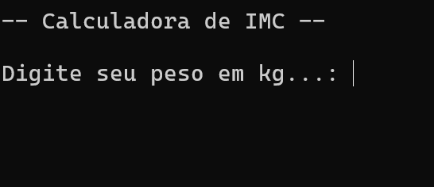
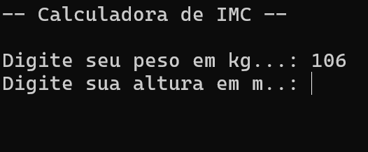
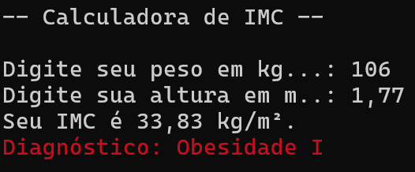

# Calculadora do IMC

## Sobre
Este é um programa desenvolvido nas aulas de Algoritmos e Lógica de Programação, da FATEC Baixada Santista, no ano de 2025.

## Instruções
Extraia o conteúdo do link de download.

### Abrindo o programa

#### Linux
`dotnet CalculadoraIMC.dll`

#### Windows
`dotnet CalculadoraIMC.dll` ou abrir o arquivo `CalculadoraIMC.exe`

### Uso do programa

1. Informe o peso: 

2. Informe a altura:

3. Veja o resultado

## Download
Acesse o programa através do [link](download/CalculadoraIMC.zip)